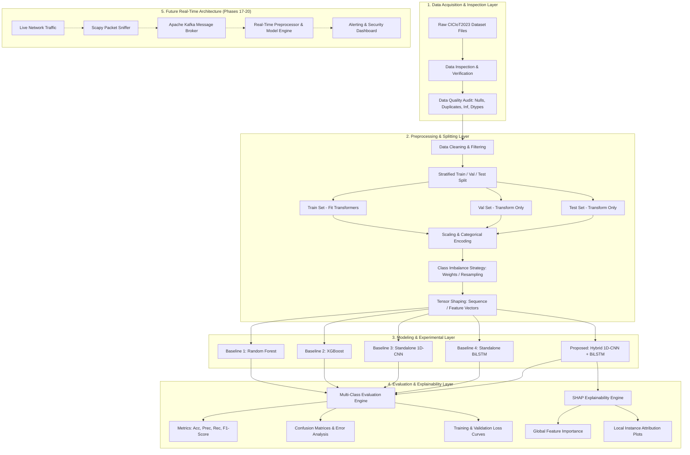

# Product Requirements Document (PRD)

# ML-Powered Intrusion Detection System (IDS) for Secure Network Monitoring

**Document Version:** 1.0  
**Phase:** Phase 1 — PRD & Requirements Engineering  
**Project Track:** B.Tech Major Project (Final Year)  
**Author / Engineering Role:** Project Team (Pair Programming with AI Architecture Assistant)  
**Status:** Approved for Baseline Planning (Phase 1 Deliverable)  
**Last Updated:** September 16, 2026  

---

## 1. Executive Summary & Project Overview

The **ML-Powered Intrusion Detection System (IDS) for Secure Network Monitoring** is a research-grounded engineering initiative designed to detect, classify, and explain malicious network traffic in IoT and modern interconnected network environments.

Traditional intrusion detection mechanisms rely heavily on static signatures, rigid heuristics, or manual feature engineering that fail against evolving attack variants and novel zero-day exploits. This project investigates data-driven machine learning (ML) and deep learning (DL) methods trained on the **CICIoT2023** dataset. The investigation encompasses traditional baselines (**Random Forest**, **XGBoost**), standalone deep learning architectures (**1D-CNN**, **BiLSTM**), and a proposed hybrid deep learning architecture (**1D-CNN + BiLSTM**) combined with **SHAP (SHapley Additive exPlanations)** for explainable artificial intelligence (XAI).

Following offline validation and empirical evaluation, the project establishes the architectural blueprint for a real-time streaming pipeline utilizing **Scapy**, **Apache Kafka**, a deployed inference engine, and a security monitoring dashboard.

---

## 2. Problem Statement

Modern IoT and enterprise networks generate high volumes of diverse network traffic across heterogeneous devices with varying security postures. Key challenges in modern network defense include:

1. **Failure Against Novel & Polymorphic Attacks:** Signature-based systems cannot generalize to unseen threats without prior signature generation.
2. **Dual Spatial-Temporal Dynamics:** Network traffic exhibits localized spatial relationships across packet/flow attributes and sequential temporal dependencies across flow streams. Standalone traditional models or single-paradigm neural nets struggle to capture both simultaneously.
3. **The Black-Box Dilemma:** Deep neural networks provide strong representational power but lack interpretability, which hinders adoption by Security Operations Center (SOC) analysts who require clear justifications before isolating network nodes.
4. **Data Quality & Imbalance in Benchmarks:** Public security datasets often exhibit extreme class imbalances, collinear features, and artifacts that lead to data leakage if not handled rigorously.

---

## 3. Project Objectives

The project aims to achieve the following specific technical milestones:

1. **Dataset Ingestion & Empirical Discovery:** Ingest the raw CICIoT2023 dataset without prior structural assumptions, determining actual schema, feature dimensions, and label distributions.
2. **Leakage-Free Preprocessing Pipeline:** Construct a modular, reproducible data transformation pipeline with strict separation between training, validation, and test splits.
3. **Baseline Benchmarking:** Train and rigorously benchmark traditional ML models (**Random Forest**, **XGBoost**) and standalone DL architectures (**1D-CNN**, **BiLSTM**).
4. **Proposed Hybrid Architecture Development:** Design, optimize, and evaluate a proposed **1D-CNN + BiLSTM** hybrid network that extracts spatial intra-flow features via 1D convolutions and models inter-flow sequence dependencies via bidirectional recurrent units.
5. **Model Explainability with SHAP:** Implement SHAP-based feature attribution to provide global feature rankings and local instance-level explanations for detected attack classes.
6. **Error Analysis & Confusion Matrix Profiling:** Perform error analysis across all classes to identify boundary confusions, false positives, and false negatives.
7. **Research Paper Preparation:** Author a research-grade technical report based exclusively on empirical experimental results.
8. **Real-Time Architecture Specification:** Provide architectural designs for live packet capture (**Scapy**), message brokering (**Apache Kafka**), and security dashboard visualization.

---

## 4. Project Scope

```
+---------------------------------------------------------------------------------------+
|                                    PROJECT SCOPE                                      |
+---------------------------------------------------------------------------------------+
| IN SCOPE (Phase 1 - Phase 16)                     | OUT OF SCOPE (Initial Phases)     |
| • CICIoT2023 dataset inspection and auditing      | • Automated attack blocking / IPS |
| • Data cleaning, scaling, and encoding pipeline   | • Offensive penetration testing   |
| • Strict stratified Train / Val / Test splitting  | • Enterprise SOC deployment       |
| • Baseline ML: Random Forest & XGBoost            | • Non-IoT network benchmarks      |
| • Deep Learning: Standalone 1D-CNN & BiLSTM       | • Live Scapy sniffing prior to    |
| • Proposed Hybrid: 1D-CNN + BiLSTM network        |   offline model validation        |
| • Comprehensive multi-class evaluation & metrics  |                                   |
| • Confusion matrix & error breakdown              |                                   |
| • Global and local SHAP explainability            |                                   |
| • Research paper preparation                      |                                   |
| • Architecture design for Kafka & Scapy stream    |                                   |
+---------------------------------------------------------------------------------------+
```

---

## 5. System Architecture & High-Level Workflow Diagrams

### 5.1 End-to-End System Architecture Diagram



### 5.2 Deep Learning Pipeline Workflow Diagram

```text
========================================================================================
                         PROPOSED HYBRID CNN-BiLSTM PIPELINE
========================================================================================

   [ Input Flow / Feature Tensor ] (Shape: [Batch, Time_Steps/Features, Channels])
                 │
                 ▼
   ┌──────────────────────────────────────────────┐
   │ 1D-CNN Block (Local Feature Extraction)      │
   │ • Conv1D Layers (Filters, Kernels, Padding)  │
   │ • BatchNormalization & ReLU / LeakyReLU      │
   │ • MaxPooling1D / Spatial Dropout             │
   └──────────────────────────────────────────────┘
                 │
                 ▼
   ┌──────────────────────────────────────────────┐
   │ BiLSTM Block (Sequential Context Modeling)   │
   │ • Bidirectional(LSTM(Units, ReturnSeq=False))│
   │ • Forward & Backward Hidden States           │
   │ • Recurrent Dropout                          │
   └──────────────────────────────────────────────┘
                 │
                 ▼
   ┌──────────────────────────────────────────────┐
   │ Dense Classification Head                    │
   │ • Fully Connected Dense Layer + Dropout      │
   │ • Softmax Activation (Multi-Class Targets)   │
   └──────────────────────────────────────────────┘
                 │
                 ▼
   [ Class Probabilities: Benign vs. Specific Attack Classes ]
                 │
                 ▼
   ┌──────────────────────────────────────────────┐
   │ SHAP Explainability Engine                   │
   │ • DeepSHAP / GradientExplainer Attribution   │
   │ • Top-K Influential Features per Prediction  │
   └──────────────────────────────────────────────┘
========================================================================================
```

---

## 6. Functional Requirements

### 6.1 Data Ingestion & Preprocessing (FR-DATA)
- **FR-DATA-01:** System shall ingest raw dataset files from `data/raw/` regardless of multi-file CSV partitioning.
- **FR-DATA-02:** System shall verify file integrity, report file sizes, byte lengths, and detect encoding anomalies without modifying original files.
- **FR-DATA-03:** System shall detect and report all instances of missing (`NaN`/`None`), duplicate, infinite (`+inf`/`-inf`), and non-numeric values.
- **FR-DATA-04:** Preprocessing transformers (Scalers, Encoders, Imputers) must be fit **only** on the training partition and applied statelessly to validation/test partitions to prevent data leakage.
- **FR-DATA-05:** Categorical labels and targets shall be mapped systematically, supporting both binary (Benign vs. Attack) and multi-class granularities.
- **FR-DATA-06:** Class imbalance must be empirically analyzed and addressed through documented methods (e.g., class weighting or controlled resampling) without arbitrary guessing.

### 6.2 Model Development & Training (FR-MOD)
- **FR-MOD-01:** System shall implement a deterministic **Random Forest Classifier** baseline with logged hyperparameters (trees, max depth, criterion).
- **FR-MOD-02:** System shall implement an **XGBoost Classifier** baseline with early stopping on the validation set.
- **FR-MOD-03:** System shall implement a standalone **1D-CNN** model designed for local feature representation.
- **FR-MOD-04:** System shall implement a standalone **BiLSTM** model designed for contextual sequence dependencies.
- **FR-MOD-05:** System shall implement the proposed **Hybrid 1D-CNN + BiLSTM** architecture combining convolution layers, pooling, bidirectional recurrence, and dense classification layers.
- **FR-MOD-06:** Deep learning models shall use standard callbacks: `ModelCheckpoint`, `EarlyStopping`, and `ReduceLROnPlateau` with versioned checkpoint saving in `models/`.
- **FR-MOD-07:** All experiments must use fixed random seeds (`numpy`, `random`, `tensorflow`/`torch`) for reproducible execution.

### 6.3 Evaluation & Diagnostics (FR-EVAL)
- **FR-EVAL-01:** System shall compute Accuracy, Precision (Macro/Weighted), Recall (Macro/Weighted), and F1-Score (Macro/Weighted) across all models on identical test partitions.
- **FR-EVAL-02:** System shall generate per-class precision, recall, and F1 metrics to detect performance disparities on minority attack categories.
- **FR-EVAL-03:** System shall compute and save normalized and non-normalized confusion matrix heatmaps to `results/confusion_matrices/`.
- **FR-EVAL-04:** Deep learning training runs shall record and plot epoch-by-epoch Training vs. Validation Loss and Accuracy curves saved to `results/graphs/`.
- **FR-EVAL-05:** System shall conduct misclassification error analysis to document which attack types are confused with benign traffic or other attacks.

### 6.4 Explainable AI & SHAP (FR-XAI)
- **FR-XAI-01:** System shall integrate SHAP to explain decisions made by the models.
- **FR-XAI-02:** System shall compute global feature importance rankings and output SHAP summary / beeswarm plots to `results/shap/`.
- **FR-XAI-03:** System shall generate local instance-level explanations (waterfall / force plots) for correctly identified attacks and misclassified samples.
- **FR-XAI-04:** High-computation explainability routines shall use stratified representative background subsets to maintain computational feasibility.

### 6.5 Future Real-Time Pipeline Requirements (FR-STREAM - Future Phases)
- **FR-STREAM-01:** System shall support packet sniffing using Scapy on designated network interfaces.
- **FR-STREAM-02:** Packet attributes shall be extracted into compatible feature vectors matching the offline model's schema.
- **FR-STREAM-03:** System shall stream extracted features into an Apache Kafka topic for distributed buffering.
- **FR-STREAM-04:** An inference consumer service shall consume Kafka messages, execute real-time prediction using the saved hybrid model, and publish alerts.
- **FR-STREAM-05:** A monitoring dashboard shall display real-time traffic statistics, attack distribution, and security alerts.

---

## 7. Non-Functional Requirements

| Category | Requirement Specification |
|:---|:---|
| **Reproducibility** | All random seeds, dataset split indices, and hyperparameter configs must be logged and fixed across runs. |
| **Data Integrity** | Original raw files in `data/raw/` must remain immutable; all transformations output to separate directories. |
| **Modularity & Clean Code** | Codebase must adhere to modular separation (`src/preprocessing/`, `src/models/`, `src/evaluation/`, `src/explainability/`, `src/realtime/`). |
| **Leakage Prevention** | Zero data leakage: statistical parameters (mean, variance, min, max, encoders) derived exclusively from the training split. |
| **Auditability & Traceability** | Every recorded metric in reports must map directly to an executed script, saved model, and output log. |
| **Extensibility** | Model classes and preprocessing pipelines must expose consistent `fit`/`transform`/`predict` interfaces. |
| **Performance Efficiency** | Deep learning models and SHAP computations must handle memory constraints gracefully via batching and sampling. |

---

## 8. Dataset Requirements (CICIoT2023)

> [!IMPORTANT]
> **Empirical Dataset Policy:** All items marked below must be verified against actual raw dataset files during Phase 3 inspection. No values are assumed in advance.

- **Dataset Identifier:** CICIoT2023 (Canadian Institute for Cybersecurity IoT Dataset 2023).
- **Target Environment:** IoT and interconnected network topologies.
- **File Format:** *To Be Determined After Dataset Inspection* (CSV, Parquet, or PCAP archives).
- **Number of Files / Partitions:** *To Be Determined After Dataset Inspection*.
- **Total Record Count:** *To Be Determined After Dataset Inspection*.
- **Feature Count & Attribute Names:** *To Be Determined After Dataset Inspection*.
- **Data Types:** *To Be Determined After Dataset Inspection*.
- **Target Label Column:** *To Be Determined After Dataset Inspection*.
- **Attack Classes & Hierarchy:** *To Be Determined After Dataset Inspection* (typically encompasses Benign, DoS, DDoS, Reconnaissance, Brute Force, Spoofing, Web Attacks).
- **Input Data Representation:** *To Be Determined After Dataset Inspection* (Flow-based statistical vectors vs. sequential packet metrics).

---

## 9. Model Architecture Specifications

### 9.1 Baseline Models

#### Random Forest Classifier
- **Role:** Traditional ensemble baseline.
- **Mechanism:** Bootstrap aggregation of decision trees with randomized feature subsets.
- **Evaluation:** Identical stratified test dataset.

#### XGBoost Classifier
- **Role:** State-of-the-art gradient boosted decision tree baseline.
- **Mechanism:** Gradient boosted decision trees minimizing multi-class log-loss with regularized objectives.
- **Evaluation:** Validation-guided early stopping.

#### Standalone 1D-CNN
- **Role:** Deep spatial pattern baseline.
- **Mechanism:** Sequence of 1D convolutions, batch normalizations, activation layers, and pooling layers followed by dense classification.

#### Standalone BiLSTM
- **Role:** Deep temporal/contextual baseline.
- **Mechanism:** Bidirectional recurrent layer processing input sequences in forward and backward directions to capture sequential dependencies.

### 9.2 Proposed Hybrid 1D-CNN + BiLSTM
- **Role:** Primary proposed deep learning architecture.
- **Architecture Philosophy:**
  1. **Spatial Feature Extraction:** 1D-CNN layers extract localized representations and feature correlations across the input dimensions.
  2. **Sequential Context Learning:** BiLSTM layers capture sequential and contextual relationships across the extracted feature maps.
  3. **Classification:** Dense layers with dropout regularization culminating in a Softmax activation layer.
- **Exact Hyperparameters & Dimensions:** *To Be Determined After Dataset Inspection and Validation Tuning* (learning rate, filter sizes, LSTM units, kernel sizes, dropout rates).

---

## 10. Model Evaluation & Comparison Plan

### 10.1 Quantitative Performance Metrics
Every candidate model will be evaluated on the unseen test set using:
$$\text{Accuracy} = \frac{TP + TN}{TP + TN + FP + FN}$$
$$\text{Precision}_{\text{Macro/Weighted}} = \frac{TP}{TP + FP}$$
$$\text{Recall}_{\text{Macro/Weighted}} = \frac{TP}{TP + FN}$$
$$\text{F1-Score}_{\text{Macro/Weighted}} = 2 \times \frac{\text{Precision} \times \text{Recall}}{\text{Precision} + \text{Recall}}$$

### 10.2 Comparative Benchmark Table (Structure)
All values will be populated exclusively upon completion of training and evaluation phases:

| Model Index | Architecture | Accuracy | Precision (Macro) | Recall (Macro) | F1-Score (Macro) | Training Time (s) | Inference Latency |
|:---:|:---|:---:|:---:|:---:|:---:|:---:|:---:|
| **M1** | Random Forest Baseline | *TBD* | *TBD* | *TBD* | *TBD* | *TBD* | *TBD* |
| **M2** | XGBoost Baseline | *TBD* | *TBD* | *TBD* | *TBD* | *TBD* | *TBD* |
| **M3** | Standalone 1D-CNN | *TBD* | *TBD* | *TBD* | *TBD* | *TBD* | *TBD* |
| **M4** | Standalone BiLSTM | *TBD* | *TBD* | *TBD* | *TBD* | *TBD* | *TBD* |
| **M5** | **Proposed Hybrid (1D-CNN + BiLSTM)** | *TBD* | *TBD* | *TBD* | *TBD* | *TBD* | *TBD* |

---

## 11. Model Explainability Requirements (SHAP)

To address the black-box nature of deep neural networks, SHAP (SHapley Additive exPlanations) based on cooperative game theory will be integrated:

```
[ Trained Model Predictions ]
              │
              ▼
   ┌──────────────────────────────────────────────┐
   │ SHAP Attribution Engine                      │
   │ (DeepSHAP / KernelExplainer / TreeExplainer) │
   └──────────────────────────────────────────────┘
              │
      ┌───────┴────────────────────────┐
      ▼                                ▼
┌───────────────────────────┐    ┌───────────────────────────┐
│ Global Interpretability   │    │ Local Interpretability    │
│ • Summary Beeswarm Plots  │    │ • Force Plots             │
│ • Feature Importance Bars │    │ • Waterfall Plots         │
│ • Cross-Feature Insights  │    │ • Per-Alert Justification │
└───────────────────────────┘    └───────────────────────────┘
```

- **Global Explanations:** Identify top-K overall network flow features that drive threat classification across all attack categories.
- **Local Explanations:** For individual alerts, show which specific feature values increased attack probability, providing SOC operators with actionable context.

---

## 12. Future Real-Time Architecture Specification

*(Planned for Phases 17–20; not active during Phase 1–16)*

```text
[ Live IoT / Network Traffic ]
               │
               ▼
   [ Scapy Sniffer Engine ] ────── (Promiscuous Packet Capture & Flow Parsing)
               │
               ▼
   [ Apache Kafka Topic: 'network-flows' ] ── (Distributed Streaming Ingestion)
               │
               ▼
   [ Real-Time Preprocessing Consumer ] ───── (Standardized Feature Vector Generation)
               │
               ▼
   [ Deployed Hybrid Model (CNN-BiLSTM) ] ─── (Real-Time Class & Probability Inference)
               │
               ▼
   [ Kafka Topic: 'ids-alerts' ] ──────────── (Stream of Classified Threats)
               │
               ▼
   [ Security Monitoring Dashboard ] ──────── (Real-Time Visuals, Threat Alerts, Logs)
```

---

## 13. Technology Stack

```
+---------------------------------------------------------------------------------------+
| LAYER                    | TECHNOLOGIES / LIBRARIES                                   |
+--------------------------+------------------------------------------------------------+
| Core Runtime             | Python 3.10+                                               |
| Data Manipulation        | NumPy, Pandas, SciPy                                       |
| Classical Machine Learn. | Scikit-Learn, XGBoost                                      |
| Deep Learning Framework  | TensorFlow / Keras (or PyTorch)                            |
| Model Explainability     | SHAP                                                       |
| Visualizations & Graphs  | Matplotlib, Seaborn                                        |
| Development & Notebooks  | Jupyter Lab, IPyKernel                                     |
| Testing & Verification   | Pytest                                                     |
| Version Control          | Git, GitHub                                                |
| Real-Time Streaming (Fut)| Scapy, Apache Kafka                                        |
+---------------------------------------------------------------------------------------+
```

---

## 14. Phased Development Roadmap (23 Phases)

```
[ Phase 01: PRD / Requirements Engineering ] <── (CURRENT COMPLETED PHASE)
      │
      ▼
[ Phase 02: Project Foundation & Environment Setup ]
      │
      ▼
[ Phase 03: CICIoT2023 Dataset Setup & Empirical Analysis ]
      │
      ▼
[ Phase 04: Data Preprocessing Pipeline ]
      │
      ▼
[ Phase 05: Stratified Train / Validation / Test Splitting ]
      │
      ▼
[ Phase 06: Baseline Model 1 — Random Forest ]
      │
      ▼
[ Phase 07: Baseline Model 2 — XGBoost ]
      │
      ▼
[ Phase 08: Deep Learning Model 1 — Standalone 1D-CNN ]
      │
      ▼
[ Phase 09: Deep Learning Model 2 — Standalone BiLSTM ]
      │
      ▼
[ Phase 10: Proposed Hybrid Architecture — 1D-CNN + BiLSTM ]
      │
      ▼
[ Phase 11: Multi-Model Evaluation & Comparative Benchmarking ]
      │
      ▼
[ Phase 12: Confusion Matrix & Detailed Error Analysis ]
      │
      ▼
[ Phase 13: SHAP Explainability & Feature Attribution ]
      │
      ▼
[ Phase 14: Experimental Setup & Environment Documentation ]
      │
      ▼
[ Phase 15: Empirical Results & Academic Discussion ]
      │
      ▼
[ Phase 16: Research Paper Preparation & Structuring ]
      │
      ▼
[ Phase 17: Packet Sniffing with Scapy (Future Stream) ]
      │
      ▼
[ Phase 18: Message Brokering with Apache Kafka (Future Stream) ]
      │
      ▼
[ Phase 19: End-to-End Real-Time IDS Streaming Integration ]
      │
      ▼
[ Phase 20: Security Monitoring & Alert Dashboard ]
      │
      ▼
[ Phase 21: Comprehensive System Testing & Edge-Case Validation ]
      │
      ▼
[ Phase 22: Final Technical Documentation & User Guides ]
      │
      ▼
[ Phase 23: Final Demo, Presentation & Project Defense Preparation ]
```

---

## 15. Risks, Limitations & Mitigations

| Risk / Limitation | Severity | Impact | Mitigation Strategy |
|:---|:---:|:---|:---|
| **Severe Class Imbalance** in CICIoT2023 | High | Poor detection of rare/minority attacks. | Calculate actual class ratios in Phase 3; apply class-weighted loss functions or controlled stratified resampling in Phase 4. |
| **Data Leakage Across Splits** | High | Artificially inflated performance metrics. | Fit scalers/encoders strictly on the training set; transform validation and test sets independently. |
| **Computational Bottlenecks during Training** | Medium | Extended training times and memory overflow. | Utilize mini-batch data loaders, mixed precision, early stopping, and GPU acceleration where available. |
| **Computational Cost of SHAP Explanations** | Medium | Long execution times for deep learning explainability. | Use representative background reference datasets (e.g., k-means clustering or stratified subsamples) for SHAP explainers. |
| **Overfitting on Dataset Artifacts** | Medium | Lack of generalization to live traffic flows. | Implement dropout layers, L2 regularization, early stopping, and validation monitoring. |
| **Real-Time Throughput Latency** | Medium | Packet drop during high-speed traffic bursts. | Decouple packet capture from inference using Apache Kafka streaming partitions and asynchronous consumers. |

---

## 16. Assumptions

1. **Dataset Integrity:** The CICIoT2023 dataset will be provided by the user in `data/raw/` and will contain valid network flow or packet representations.
2. **Compute Environment:** Python 3.10+ execution environment with CPU/GPU compute capability sufficient for baseline and deep learning training runs.
3. **No Fabricated Benchmarks:** All reported metrics, parameters, and results will be generated through empirical code execution.
4. **Offline Priority:** The offline machine learning and deep learning models must be fully validated and benchmarked before starting real-time stream development.

---

## 17. Success Criteria for Phase 1

- [x] Comprehensive Product Requirements Document (PRD) created and saved to `docs/PRD.md`.
- [x] Clear scope demarcation (In-Scope, Out-of-Scope, Future Phases).
- [x] High-level system architecture and deep learning pipeline diagrams constructed.
- [x] Functional requirements (Data, Modeling, Evaluation, XAI, Streaming) documented.
- [x] Non-functional requirements (Reproducibility, Integrity, Modularity) specified.
- [x] 23-phase sequential project roadmap established.
- [x] Zero model training performed.
- [x] Zero fabricated statistics or metrics generated.
- [x] Zero premature real-time code implemented.
