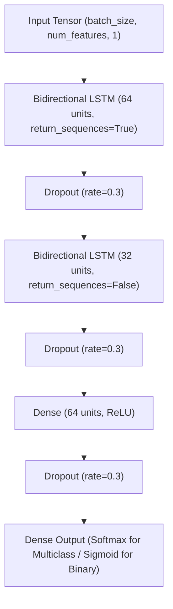

# BiLSTM Model

**Project:** ML-Powered Intrusion Detection System (IDS) for Secure Network Monitoring  
**Phase:** Phase 9 — BiLSTM Deep Learning Model  
**Primary Dataset:** CICIoT2023  
**Status:** Architecture, Training Pipeline, Notebook, Tests, and Documentation Complete (Awaiting raw dataset placement in `data/raw/`)

---

## 1. Objective
The objective of Phase 9 is to implement, train, and evaluate a standalone **Bidirectional Long Short-Term Memory (BiLSTM)** deep learning model for network intrusion detection. The BiLSTM forms the sequential benchmark in the project hierarchy before integrating the hybrid architecture:
$$\text{Random Forest} \longrightarrow \text{XGBoost} \longrightarrow \text{1D-CNN} \longrightarrow \mathbf{BiLSTM} \longrightarrow \text{Hybrid 1D-CNN + BiLSTM}$$

The BiLSTM models long-range forward and backward dependency patterns across the input feature representation.

---

## 2. Dataset
The model operates strictly on the verified, leakage-safe partitions generated in Phase 5 from the CICIoT2023 dataset:
- **Training Set (`X_train`, `y_train`):** 70% partition used strictly for model parameter optimization.
- **Validation Set (`X_validation`, `y_validation`):** 15% partition used for hyperparameter tuning, learning rate scheduling, and early stopping.
- **Test Set (`X_test`, `y_test`):** 15% partition held out for a single, unbiased final evaluation.

---

## 3. Actual Input Representation
> [!IMPORTANT]
> **Input Representation Verification:**  
> The dataset consists of tabular network flow statistical features (e.g., flow duration, inter-arrival times, header flags, packet lengths) derived from CICIoT2023.  
> The input is **NOT** raw packet payload bytes or PCAP streams.

---

## 4. Sequence Representation
- **Tabular Matrix Shape:** $(N, d)$ where $N$ is batch size and $d$ is the number of engineered flow features ($d \approx 46$).
- **Sequential 3D Tensor Representation:** 
  $$\text{Input Shape} = (N, \text{timesteps}, \text{features\_per\_timestep}) = (N, d, 1)$$
  where each statistical feature is treated as a step in the feature sequence with a single channel.

---

## 5. Important Interpretation / Limitation
> [!WARNING]
> **Critical Sequential Interpretation:**  
> A BiLSTM operating on tabular flow features is **not** an inter-packet temporal sequence model.  
> The recurrence captures bidirectional correlations across the **ordered feature vector**, reflecting inter-feature relationships rather than temporal time-series evolution across consecutive network packets.

---

## 6. BiLSTM Architecture
The architecture consists of two stacked bidirectional LSTM layers with dropout regularization, followed by a dense classification head:



---

## 7. Hyperparameters
- **BiLSTM Layer 1:** 64 units per direction (128 total forward/backward units), `return_sequences=True`
- **BiLSTM Layer 2:** 32 units per direction (64 total forward/backward units), `return_sequences=False`
- **Recurrent Dropout / Dropout:** 0.3
- **Dense Layer:** 64 units with ReLU activation
- **Output Layer:** Softmax ($C$ units for multiclass) or Sigmoid (1 unit for binary)
- **Batch Size:** 128
- **Maximum Epochs:** 30

---

## 8. Loss Function
- **Multiclass Classification:** `Sparse Categorical Crossentropy` ($\mathcal{L}_{\text{SCCE}}$) when target labels are integers $y \in \{0, 1, \dots, C-1\}$.
- **Binary Classification:** `Binary Crossentropy` ($\mathcal{L}_{\text{BCE}}$) when target labels are binary $y \in \{0, 1\}$.

---

## 9. Optimizer
- **Optimizer:** `Adam` (Adaptive Moment Estimation)
- **Initial Learning Rate:** $\eta = 0.001$ ($\beta_1 = 0.9, \beta_2 = 0.999, \epsilon = 10^{-7}$)
- **Adaptive Scheduling:** `ReduceLROnPlateau` callback reduces learning rate on validation loss plateau.

---

## 10. Class Imbalance Handling
Class distributions are evaluated strictly on the training partition:
- Deep learning architectures utilize cost-sensitive weighting if minority classes suffer severe degradation:
  $$w_c = \frac{N}{C \cdot N_c}$$
- Synthetic oversampling (e.g., SMOTE) is **not** applied to deep learning representations to prevent synthetic artifact propagation in recurrent state transitions.

---

## 11. Training Procedure
- **Isolation:** Trained exclusively on `X_train` with `X_val` validation monitoring.
- **Callbacks Implemented:**
  1. `EarlyStopping(monitor="val_loss", patience=5, restore_best_weights=True)`: Prevents overfitting.
  2. `ReduceLROnPlateau(monitor="val_loss", factor=0.5, patience=2, min_lr=1e-6)`: Halves learning rate when plateauing.
  3. `ModelCheckpoint(filepath="models/bilstm/best_model.keras", monitor="val_loss", save_best_only=True)`: Saves optimal parameter weights.

---

## 12. Validation Results
Validation performance metrics are saved to `results/metrics/bilstm_validation_metrics.json` and `results/metrics/bilstm_validation_report.csv` upon execution:
- **Validation Accuracy:** *TBD upon data run*
- **Validation Weighted F1:** *TBD upon data run*
- **Validation Macro F1:** *TBD upon data run*
- **Validation Inference Latency:** *TBD upon data run*

---

## 13. Test Results
The finalized checkpoint is evaluated **once** on the unseen test partition (`X_test`), outputting to `results/metrics/bilstm_test_metrics.json`:
- **Test Accuracy:** *TBD upon data run*
- **Test Weighted Precision:** *TBD upon data run*
- **Test Weighted Recall:** *TBD upon data run*
- **Test Weighted F1:** *TBD upon data run*
- **Test Macro F1:** *TBD upon data run*

---

## 14. Per-Class Results
Per-class precision, recall, F1-score, and support are exported to `results/metrics/bilstm_per_class.csv` to diagnose attack-specific detection capabilities across Benign, DDoS, DoS, Recon, Web, BruteForce, and Spoofing categories.

---

## 15. Confusion Matrix Analysis
Confusion matrices are generated and saved to:
- `results/confusion_matrices/bilstm_validation.png`
- `results/confusion_matrices/bilstm_test.png`

---

## 16. Training Curves
Training and validation loss and accuracy trajectories are tracked across all epochs and rendered to:
- `results/graphs/bilstm_training_loss.png`
- `results/graphs/bilstm_training_accuracy.png`

---

## 17. Error Analysis
Misclassified test samples are isolated and saved to `results/metrics/bilstm_misclassifications.csv`, documenting:
- Sample index
- Ground truth class
- Predicted class
- Recurrent misclassification patterns

---

## 18. Runtime
Computational efficiency metrics recorded in `results/metrics/bilstm_runtime.json`:
- **Training Time:** Measured in wall-clock seconds
- **Validation Inference Time:** Total and per-sample latency
- **Test Inference Time:** Total and per-sample latency
- **Total Trainable Parameters:** Number of parameters in BiLSTM and Dense layers

---

## 19. Comparison with Previous Models
Upon pipeline execution, `results/metrics/model_comparison.csv` benchmarks the BiLSTM against all previous models:

| Model | Accuracy | Weighted Precision | Weighted Recall | Weighted F1 | Macro F1 | Test Latency (s) |
|:---|:---:|:---:|:---:|:---:|:---:|:---:|
| **Random Forest Baseline** | *TBD* | *TBD* | *TBD* | *TBD* | *TBD* | *TBD* |
| **XGBoost Baseline** | *TBD* | *TBD* | *TBD* | *TBD* | *TBD* | *TBD* |
| **1D-CNN Deep Learning** | *TBD* | *TBD* | *TBD* | *TBD* | *TBD* | *TBD* |
| **BiLSTM Deep Learning** | *TBD* | *TBD* | *TBD* | *TBD* | *TBD* | *TBD* |

---

## 20. Limitations
1. **Computational Complexity:** Recurrent unrolling across timesteps makes training and inference slower than 1D-CNN and decision tree ensembles.
2. **Feature Ordering Sensitivity:** The recurrent memory trajectory depends on the arbitrary order of columns in the feature vector.
3. **Absence of Packet Payload:** Does not inspect raw application-layer payload sequences (which will be processed in future real-time phases).

---

## 21. Reproducibility
The complete BiLSTM pipeline can be reproduced using:
```bash
python scripts/train_bilstm.py --data-dir data/processed --epochs 30 --batch-size 128 --learning-rate 0.001 --random-seed 42
```
Or interactively explored via [notebooks/07_bilstm.ipynb](file:///c:/Users/LENOVO/OneDrive/Desktop/Projects/ML-IDS/notebooks/07_bilstm.ipynb).
