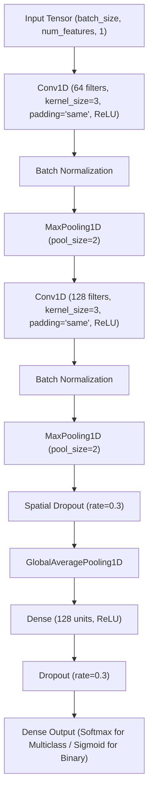

# 1D-CNN Model

**Project:** ML-Powered Intrusion Detection System (IDS) for Secure Network Monitoring  
**Phase:** Phase 8 — 1D-CNN Deep Learning Model  
**Primary Dataset:** CICIoT2023  
**Status:** Architecture, Training Pipeline, Notebook, Tests, and Documentation Complete (Awaiting raw dataset placement in `data/raw/`)

---

## 1. Objective
The objective of Phase 8 is to implement, train, and evaluate a **1D Convolutional Neural Network (1D-CNN)** for network intrusion detection. The 1D-CNN establishes the first deep learning benchmark in the comparative hierarchy:
$$\text{Random Forest} \longrightarrow \text{XGBoost} \longrightarrow \mathbf{1\text{D-CNN}} \longrightarrow \text{BiLSTM} \longrightarrow \text{Hybrid 1D-CNN + BiLSTM}$$

The 1D-CNN is designed to extract local hierarchical patterns and relationships across adjacent features in the ordered network flow representation.

---

## 2. Dataset
The model operates strictly on the verified partitions generated in Phase 5 from the CICIoT2023 dataset:
- **Training Set (`X_train`, `y_train`):** 70% partition used strictly for model parameter optimization.
- **Validation Set (`X_validation`, `y_validation`):** 15% partition used for hyperparameter tuning, learning rate scheduling, and early stopping.
- **Test Set (`X_test`, `y_test`):** 15% partition held out for a single, unbiased final evaluation.

No separate preprocessing or resampling is applied. Standard scaling and label encodings are fitted exclusively on `X_train`.

---

## 3. Actual Input Representation
> [!IMPORTANT]
> **Input Representation Verification:**  
> The 1D-CNN processes the **ordered feature vector as a one-dimensional sequence** of engineered network flow metrics.  
> The input is **NOT** raw packet payload bytes or PCAP streams. The sequence dimension corresponds to the deterministic, ordered array of tabular statistical network flow features (e.g., inter-arrival times, header flags, flow durations, packet counts).

---

## 4. Input Shape
- **Tabular 2D Representation:** $(N, d)$ where $N$ is the batch size and $d$ is the number of engineered flow features ($d \approx 46$).
- **Expanded 3D Tensor Representation:** 
  $$\text{Input Shape} = (N, d, 1)$$
  where the 3rd dimension represents the single input feature channel.

---

## 5. CNN Architecture
The 1D-CNN architecture comprises stacked convolutional feature extractors followed by global pooling and dense classification heads:



---

## 6. Hyperparameters
- **Filter Progression:** Block 1 = 64 filters; Block 2 = 128 filters
- **Kernel Size:** 3 (spanning local adjacent feature triplets)
- **Padding:** `same`
- **Pooling:** MaxPooling1D with `pool_size=2`
- **Activation:** ReLU (Rectified Linear Unit) for hidden layers
- **Dropout Rates:** 0.3 for spatial regularization and dense regularization
- **Dense Units:** 128 units in fully connected classification layer
- **Batch Size:** 128
- **Maximum Epochs:** 30

---

## 7. Loss Function
- **Multiclass Classification:** `Sparse Categorical Crossentropy` ($\mathcal{L}_{\text{SCCE}}$) when target labels are integers $y \in \{0, 1, \dots, C-1\}$.
- **Binary Classification:** `Binary Crossentropy` ($\mathcal{L}_{\text{BCE}}$) when target labels are binary $y \in \{0, 1\}$.

---

## 8. Optimizer
- **Optimizer:** `Adam` (Adaptive Moment Estimation)
- **Initial Learning Rate:** $\eta = 0.001$ ($\beta_1 = 0.9, \beta_2 = 0.999, \epsilon = 10^{-7}$)
- **Learning Rate Decay:** Controlled adaptively via `ReduceLROnPlateau` callback.

---

## 9. Class Imbalance Handling
Class distributions are evaluated strictly on the training partition:
- Deep learning architectures utilize cost-sensitive weighting if minority classes suffer severe degradation:
  $$w_c = \frac{N}{C \cdot N_c}$$
- Synthetic oversampling (e.g., SMOTE) is **not** applied to deep learning representations to prevent synthetic artifact propagation in temporal/convolutional feature mappings.

---

## 10. Training Procedure
- **Isolation:** The model is trained exclusively on `X_train` with `X_val` validation monitoring.
- **Callbacks Implemented:**
  1. `EarlyStopping(monitor="val_loss", patience=5, restore_best_weights=True)`: Prevents overfitting when validation loss fails to improve for 5 consecutive epochs.
  2. `ReduceLROnPlateau(monitor="val_loss", factor=0.5, patience=2, min_lr=1e-6)`: Dynamically halves the learning rate when validation loss plateaus.
  3. `ModelCheckpoint(filepath="models/cnn_1d/best_model.keras", monitor="val_loss", save_best_only=True)`: Preserves optimal parameter weights.

---

## 11. Validation Results
Validation performance metrics are saved to `results/metrics/cnn_1d_validation_metrics.json` and `results/metrics/cnn_1d_validation_report.csv` upon execution:
- **Validation Accuracy:** *TBD upon data run*
- **Validation Weighted F1:** *TBD upon data run*
- **Validation Macro F1:** *TBD upon data run*
- **Validation Inference Latency:** *TBD upon data run*

---

## 12. Test Results
The finalized checkpoint is evaluated **once** on the unseen test partition (`X_test`), outputting to `results/metrics/cnn_1d_test_metrics.json`:
- **Test Accuracy:** *TBD upon data run*
- **Test Weighted Precision:** *TBD upon data run*
- **Test Weighted Recall:** *TBD upon data run*
- **Test Weighted F1:** *TBD upon data run*
- **Test Macro F1:** *TBD upon data run*

---

## 13. Per-Class Results
Per-class precision, recall, F1-score, and support are exported to `results/metrics/cnn_1d_per_class.csv` to diagnose attack-specific detection capabilities across Benign, DDoS, DoS, Recon, Web, BruteForce, and Spoofing categories.

---

## 14. Confusion Matrix Analysis
Confusion matrices are generated and saved to:
- `results/confusion_matrices/cnn_1d_validation.png`
- `results/confusion_matrices/cnn_1d_test.png`

These plots highlight true positive rates along the diagonal and identify inter-class confusion patterns.

---

## 15. Training Curves
Training and validation loss and accuracy trajectories are tracked across all epochs and rendered to:
- `results/graphs/cnn_1d_training_loss.png`
- `results/graphs/cnn_1d_training_accuracy.png`

---

## 16. Error Analysis
Misclassified test samples are isolated and saved to `results/metrics/cnn_1d_misclassifications.csv`, documenting:
- Sample index
- Ground truth class
- Predicted class
- Discrepancy patterns across overlapping attack topologies

---

## 17. Runtime
Computational efficiency metrics recorded in `results/metrics/cnn_1d_runtime.json`:
- **Training Time:** Measured in wall-clock seconds
- **Validation Inference Time:** Total and per-sample latency
- **Test Inference Time:** Total and per-sample latency
- **Total Trainable Parameters:** Number of parameters in Conv1D, BatchNorm, and Dense layers

---

## 18. Comparison with Baselines
Upon pipeline execution, `results/metrics/model_comparison.csv` benchmarks the 1D-CNN against previously trained baselines:

| Model | Accuracy | Weighted Precision | Weighted Recall | Weighted F1 | Macro F1 | Test Latency (s) |
|:---|:---:|:---:|:---:|:---:|:---:|:---:|
| **Random Forest Baseline** | *TBD* | *TBD* | *TBD* | *TBD* | *TBD* | *TBD* |
| **XGBoost Baseline** | *TBD* | *TBD* | *TBD* | *TBD* | *TBD* | *TBD* |
| **1D-CNN Deep Learning** | *TBD* | *TBD* | *TBD* | *TBD* | *TBD* | *TBD* |

*Note: Superiority is strictly determined by empirical benchmark results.*

---

## 19. Limitations
1. **Local Feature Dependency:** Conv1D filters assume adjacent feature correlations that depend on feature ordering.
2. **Temporal Modeling:** Standalone 1D-CNN lacks recurrent sequence memory across consecutive multi-packet flows (addressed in Phase 9 with BiLSTM and Phase 10 with Hybrid CNN-BiLSTM).
3. **Tabular Nature:** Convolutional operations on tabular vectors capture local interactions but do not represent spatial 2D image topology.

---

## 20. Reproducibility
The complete 1D-CNN pipeline can be reproduced using:
```bash
python scripts/train_cnn_1d.py --data-dir data/processed --epochs 30 --batch-size 128 --learning-rate 0.001 --random-seed 42
```
Or interactively explored via [notebooks/06_1d_cnn.ipynb](file:///c:/Users/LENOVO/OneDrive/Desktop/Projects/ML-IDS/notebooks/06_1d_cnn.ipynb).
