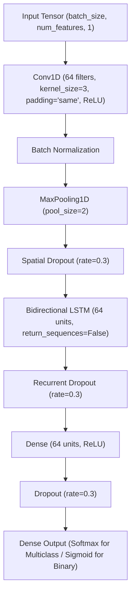

# Proposed CNN + BiLSTM Model

**Project:** ML-Powered Intrusion Detection System (IDS) for Secure Network Monitoring  
**Phase:** Phase 10 — Proposed Hybrid CNN + BiLSTM Model  
**Primary Dataset:** CICIoT2023  
**Status:** Architecture, Training Pipeline, Notebook, Tests, and Documentation Complete (Awaiting raw dataset placement in `data/raw/`)

---

## 1. Objective
Phase 10 develops and evaluates the **proposed primary model** of the project: the **Hybrid 1D-CNN + BiLSTM** neural network. This architecture combines spatial/local feature extraction via 1D convolutions with bidirectional recurrent memory via BiLSTM:
$$\text{Random Forest} \longrightarrow \text{XGBoost} \longrightarrow \text{1D-CNN} \longrightarrow \text{BiLSTM} \longrightarrow \mathbf{Proposed\ Hybrid\ CNN + BiLSTM}$$

The objective is to evaluate whether hierarchical local feature fusion combined with forward/backward sequence modeling provides empirical benefits over classical baselines and standalone deep learning models on the CICIoT2023 benchmark.

---

## 2. Dataset
The model operates strictly on the verified, leakage-safe partitions generated in Phase 5:
- **Training Set (`X_train`, `y_train`):** 70% partition used strictly for model parameter optimization.
- **Validation Set (`X_validation`, `y_validation`):** 15% partition used for hyperparameter tuning, learning rate scheduling, and early stopping.
- **Test Set (`X_test`, `y_test`):** 15% partition held out for a single, unbiased final evaluation.

---

## 3. Actual Dataset Representation
> [!IMPORTANT]
> **Dataset Representation:**  
> The dataset consists of standardized tabular statistical network flow feature vectors (e.g., flow durations, inter-arrival times, header flags, packet lengths) derived from CICIoT2023.  
> The input is **NOT** raw packet payload bytes or PCAP bitstreams.

---

## 4. Input Representation
- **Tabular 2D Matrix:** $(N, d)$ where $N$ is batch size and $d \approx 46$ features.
- **Expanded Sequential 3D Tensor:** 
  $$\text{Input Shape} = (N, d, 1)$$
  where $d$ represents the sequence length of ordered flow features and $1$ is the channel dimension.

---

## 5. Architecture
The hybrid architecture couples convolutional feature extraction, batch normalization, pooling, bidirectional recurrent sequence processing, and a dense classification head:



---

## 6. CNN Component
- **Conv1D Layer:** Applies 64 kernels of size 3 with `same` padding and ReLU activation.
- **Role:** Extracts local correlations across adjacent feature triplets in the ordered flow vector.
- **Batch Normalization & Pooling:** Stabilizes internal covariate shift and downsamples sequence length by factor of 2.

---

## 7. BiLSTM Component
- **Bidirectional LSTM Layer:** 64 units per direction (128 total forward/backward units), `return_sequences=False`.
- **Role:** Traverses the downsampled convolutional feature sequence in both forward and reverse directions, capturing contextual dependencies across the feature representation.

---

## 8. Classification Layer
- **Dense Layer:** 64 units with ReLU activation and 0.3 dropout.
- **Output Layer:** Softmax activation for multiclass ($C$ units) or Sigmoid activation for binary classification (1 unit).

---

## 9. Hyperparameters
- **Conv1D Filters:** 64 ($k = 3$, padding = `same`)
- **Pooling:** MaxPooling1D ($\text{pool\_size} = 2$)
- **BiLSTM Units:** 64 units per direction
- **Dense Units:** 64 units
- **Dropout Rate:** 0.3 across spatial, recurrent, and dense layers
- **Batch Size:** 128
- **Maximum Epochs:** 30

---

## 10. Loss Function
- **Multiclass Classification:** `Sparse Categorical Crossentropy` ($\mathcal{L}_{\text{SCCE}}$) when target labels are integers $y \in \{0, 1, \dots, C-1\}$.
- **Binary Classification:** `Binary Crossentropy` ($\mathcal{L}_{\text{BCE}}$) when target labels are binary $y \in \{0, 1\}$.

---

## 11. Optimizer
- **Optimizer:** `Adam`
- **Initial Learning Rate:** $\eta = 0.001$ ($\beta_1 = 0.9, \beta_2 = 0.999, \epsilon = 10^{-7}$)
- **Adaptive Scheduling:** `ReduceLROnPlateau` callback reduces learning rate by factor 0.5 when validation loss plateaus for 2 consecutive epochs.

---

## 12. Class Imbalance Handling
Class distributions are evaluated strictly on the training partition:
- Deep learning architectures utilize cost-sensitive weighting if minority classes suffer severe degradation:
  $$w_c = \frac{N}{C \cdot N_c}$$
- Synthetic oversampling (e.g., SMOTE) is **not** applied to deep learning representations to prevent synthetic artifact propagation in temporal/convolutional feature mappings.

---

## 13. Training Procedure
- **Isolation:** Trained exclusively on `X_train` with `X_val` validation monitoring.
- **Callbacks Implemented:**
  1. `EarlyStopping(monitor="val_loss", patience=5, restore_best_weights=True)`: Halts training if validation loss does not improve for 5 epochs.
  2. `ReduceLROnPlateau(monitor="val_loss", factor=0.5, patience=2, min_lr=1e-6)`: Dynamically adjusts learning rate.
  3. `ModelCheckpoint(filepath="models/cnn_bilstm/best_model.keras", monitor="val_loss", save_best_only=True)`: Preserves optimal parameter weights.

---

## 14. Validation Results
Validation performance metrics are saved to `results/metrics/cnn_bilstm_validation_metrics.json` and `results/metrics/cnn_bilstm_validation_report.csv` upon execution:
- **Validation Accuracy:** *TBD upon data run*
- **Validation Weighted F1:** *TBD upon data run*
- **Validation Macro F1:** *TBD upon data run*
- **Validation Inference Latency:** *TBD upon data run*

---

## 15. Test Results
The finalized checkpoint is evaluated **once** on the unseen test partition (`X_test`), outputting to `results/metrics/cnn_bilstm_test_metrics.json`:
- **Test Accuracy:** *TBD upon data run*
- **Test Weighted Precision:** *TBD upon data run*
- **Test Weighted Recall:** *TBD upon data run*
- **Test Weighted F1:** *TBD upon data run*
- **Test Macro F1:** *TBD upon data run*

---

## 16. Per-Class Results
Per-class precision, recall, F1-score, and support are exported to `results/metrics/cnn_bilstm_per_class.csv` across Benign, DDoS, DoS, Recon, Web, BruteForce, and Spoofing categories.

---

## 17. Confusion Matrix Analysis
Confusion matrices are saved to:
- `results/confusion_matrices/cnn_bilstm_validation.png`
- `results/confusion_matrices/cnn_bilstm_test.png`

---

## 18. Error Analysis
Misclassified test samples are isolated and saved to `results/metrics/cnn_bilstm_misclassifications.csv`, documenting:
- Sample index
- Ground truth class
- Predicted class
- Prediction confidence

---

## 19. Runtime & Complexity
Computational efficiency metrics recorded in `results/metrics/cnn_bilstm_runtime.json`:
- **Training Time:** Measured in wall-clock seconds
- **Validation Inference Time:** Total and per-sample latency
- **Test Inference Time:** Total and per-sample latency
- **Total Trainable Parameters:** Number of parameters across Conv1D, BiLSTM, and Dense layers
- **Model Checkpoint Size:** Size in megabytes (MB)

---

## 20. Comparison with Baselines
Upon pipeline execution, `results/metrics/model_comparison.csv` and `results/metrics/model_comparison_extended.csv` benchmark all five project models:

| Model | Accuracy | Weighted Precision | Weighted Recall | Weighted F1 | Macro F1 | Test Latency (s) | Trainable Params |
|:---|:---:|:---:|:---:|:---:|:---:|:---:|:---:|
| **Random Forest Baseline** | *TBD* | *TBD* | *TBD* | *TBD* | *TBD* | *TBD* | N/A (Trees) |
| **XGBoost Baseline** | *TBD* | *TBD* | *TBD* | *TBD* | *TBD* | *TBD* | N/A (Trees) |
| **1D-CNN Deep Learning** | *TBD* | *TBD* | *TBD* | *TBD* | *TBD* | *TBD* | *TBD* |
| **BiLSTM Deep Learning** | *TBD* | *TBD* | *TBD* | *TBD* | *TBD* | *TBD* | *TBD* |
| **Proposed Hybrid CNN + BiLSTM** | *TBD* | *TBD* | *TBD* | *TBD* | *TBD* | *TBD* | *TBD* |

> [!NOTE]
> Performance superiority claims will be strictly determined and quantified by the empirical test metrics once raw data is processed and evaluated.

---

## 21. Limitations
1. **Feature Ordering:** Conv1D and BiLSTM assume a static ordering of tabular features.
2. **Computational Footprint:** Hybrid architecture requires more floating-point operations (FLOPs) than standalone Conv1D.
3. **Payload Inspection:** Operating on flow statistics rather than deep payload inspection (which is addressed in future real-time phases).

---

## 22. Reproducibility
The proposed hybrid pipeline can be executed via CLI:
```bash
python scripts/train_cnn_bilstm.py --data-dir data/processed --epochs 30 --batch-size 128 --learning-rate 0.001 --random-seed 42
```
Or interactively explored via [notebooks/08_cnn_bilstm.ipynb](file:///c:/Users/LENOVO/OneDrive/Desktop/Projects/ML-IDS/notebooks/08_cnn_bilstm.ipynb).
